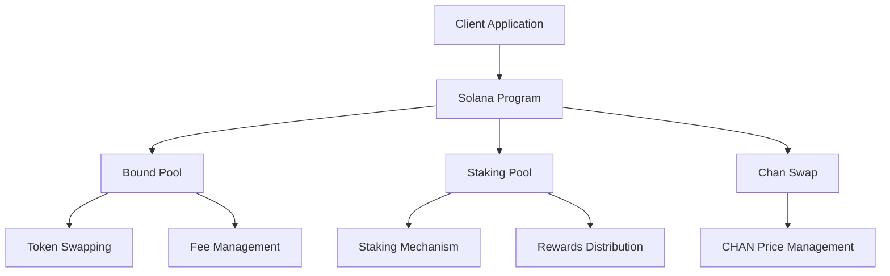
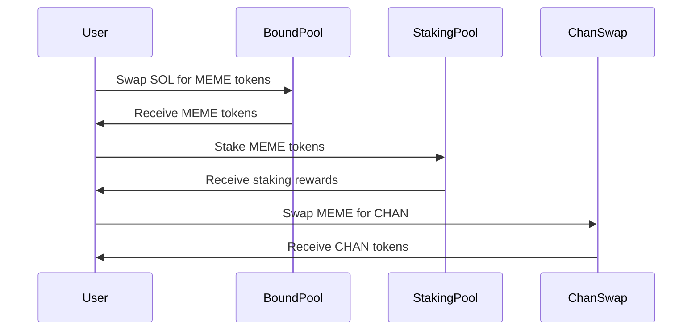
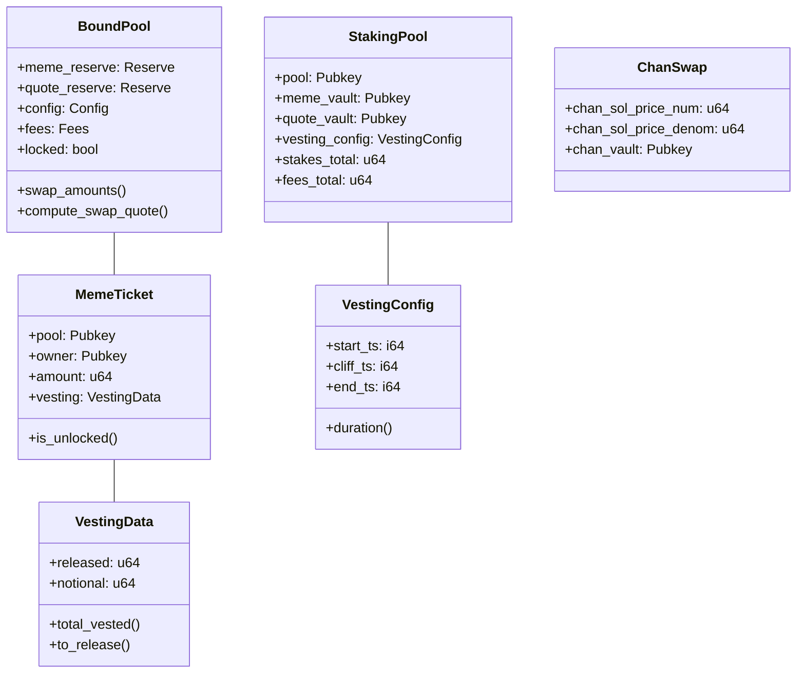
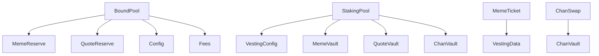
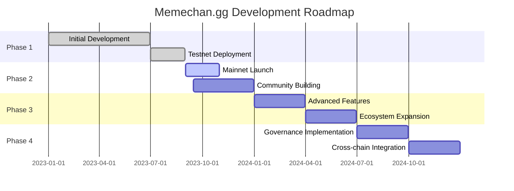
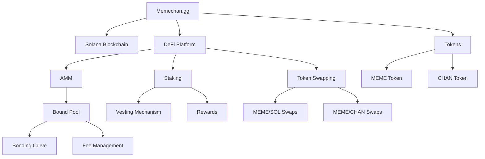

# Memechan.gg Solana Implementation

## Overview

Memechan.gg is a decentralized finance (DeFi) platform built on the Solana blockchain. It provides a suite of financial tools including an Automated Market Maker (AMM), token swapping, staking mechanisms, and fee management systems. The platform is designed to facilitate the trading and management of the CHAN token within a custom bonding curve mechanism.

## Table of Contents

- [Architecture](#architecture)
- [Key Components](#key-components)
- [Installation and Setup](#installation-and-setup)
- [Usage Examples](#usage-examples)
- [Technical Documentation](#technical-documentation)
- [Deployment](#deployment)
- [Testing](#testing)
- [Roadmap](#roadmap)

## Architecture

The Memechan.gg platform is built using the Anchor framework for Solana, with a focus on security, efficiency, and user experience. The core architecture consists of several interconnected components:



### Core Components Interaction



## Key Components

### Bound Pool

The Bound Pool is the core AMM component that manages the bonding curve between SOL and MEME tokens. It implements a custom mathematical formula to determine token prices based on supply and demand.

Key features:
- Custom bonding curve implementation
- Fee collection and distribution
- Admin controls for parameter adjustments

### Staking Pool

The Staking Pool allows users to stake their MEME tokens to earn rewards. It implements a vesting mechanism to encourage long-term holding.

Key features:
- Token staking with time-based vesting
- Reward distribution
- Ticket-based staking management

### Chan Swap

Chan Swap facilitates the exchange between MEME tokens and CHAN tokens at a fixed or adjustable rate.

Key features:
- Fixed price swapping
- Admin controls for price adjustments
- Fee collection

### Vesting Mechanism

The vesting mechanism controls the release of tokens over time, implementing both cliff and linear vesting periods.

Key features:
- Configurable cliff period
- Linear vesting after cliff
- Instant token percentage

## Installation and Setup

### Prerequisites

- Solana CLI (v1.17.31 or higher)
- Anchor CLI (v0.29.0 or higher)
- Node.js (v14 or higher)
- Yarn

### Installation

1. Clone the repository:
   ```bash
   git clone https://github.com/memechan-gg/memechan-sol.git
   cd memechan-sol
   ```

2. Install dependencies:
   ```bash
   yarn install
   ```

3. Build the program:
   ```bash
   anchor build
   ```

## Usage Examples

### Creating a New Pool

```typescript
// Initialize a new bound pool
const pool = await BoundPoolWrapper.new();

// Create metadata for the token
await program.methods
  .createMetadata("MEME Token", "MEME", "https://example.com/metadata")
  .accounts({
    // Account details
  })
  .rpc();
```

### Swapping Tokens

```typescript
// Swap SOL for MEME tokens
const ticketId = await pool.swap_y({
  memeTokensOut: new BN(1),
  quoteTokensIn: new BN(amountInSol * 1e9),
});

// Swap MEME for SOL
await pool.swap_x({
  memeTokensIn: new BN(amountInMeme),
  quoteTokensOut: new BN(minimumSolExpected * 1e9),
});
```

### Staking Tokens

```typescript
// Initialize a staking pool
await program.methods
  .initStakingPool()
  .accounts({
    // Account details
  })
  .rpc();

// Stake tokens
await stakingPool.stake(amountToStake);

// Unstake tokens
await program.methods
  .unstake(new BN(amountToUnstake))
  .accounts({
    // Account details
  })
  .rpc();
```

## Technical Documentation

### Program Structure



### Key Mathematical Models

The Bound Pool implements a custom bonding curve with the following key parameters:

- `alpha_abs`: Controls the steepness of the curve
- `beta`: Controls the starting point of the curve
- `gamma_s`: Target amount of quote tokens (SOL)
- `gamma_m`: Maximum amount of MEME tokens
- `omega_m`: Maximum amount of MEME tokens for LP

The price of MEME tokens is determined by the formula:

```
price = alpha_abs * (current_supply / max_supply)^beta
```

### Account Structure



## Deployment

### Localnet Testing

```bash
yarn test
```

### Devnet Deployment

```bash
# Build for testing
yarn build-testing

# Write buffer
yarn write-buffer

# Deploy
yarn dt
```

### Mainnet Deployment

1. Generate a new keypair:
   ```bash
   solana-keygen new -o kp.json
   ```

2. Update the program ID in `lib.rs`:
   ```rust
   #[cfg(feature = "mainnet")]
   declare_id!("your_program_id_here");
   ```

3. Build for mainnet:
   ```bash
   anchor build -- --features mainnet --no-default-features
   ```

4. Generate a buffer keypair:
   ```bash
   cd ./target/deploy
   solana-keygen new -o bufkey.json
   ```

5. Write to buffer:
   ```bash
   solana program write-buffer --buffer bufkey.json memechan_sol.so
   ```

6. Deploy:
   ```bash
   solana program deploy --buffer bufkey.json --program-id kp.json
   ```

## Testing

The project includes comprehensive tests for all components:

- Unit tests for Rust code
- Integration tests using Anchor's TypeScript framework
- Property-based tests for mathematical models

Run tests with:

```bash
# Run all tests
anchor test

# Run specific tests
yarn run ts-mocha -p ./tsconfig.json -t 1000000 tests/specific_test.ts
```

For property-based tests:

```bash
cargo test --package memechan-sol --lib --all-features -- models::bound::tests --show-output
```

## Roadmap



### Future Development

1. **Governance System**
   - DAO implementation for community governance
   - Proposal and voting mechanisms

2. **Enhanced AMM Features**
   - Multi-token pools
   - Concentrated liquidity options

3. **Cross-chain Integration**
   - Bridges to Ethereum and other blockchains
   - Cross-chain token transfers

4. **Mobile Application**
   - Native mobile apps for iOS and Android
   - Mobile-optimized user experience

## Knowledge Graph



## Contributors

- Memechan.gg Team

## License

This project is licensed under the [MIT License](LICENSE).

## Acknowledgments

- Raydium for their math library
- Solana Foundation for their support
- Anchor framework developers