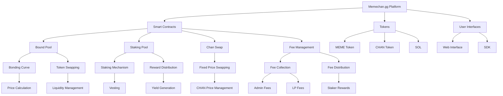
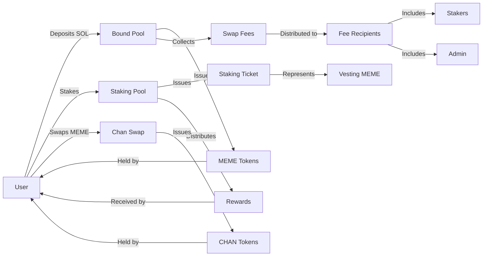
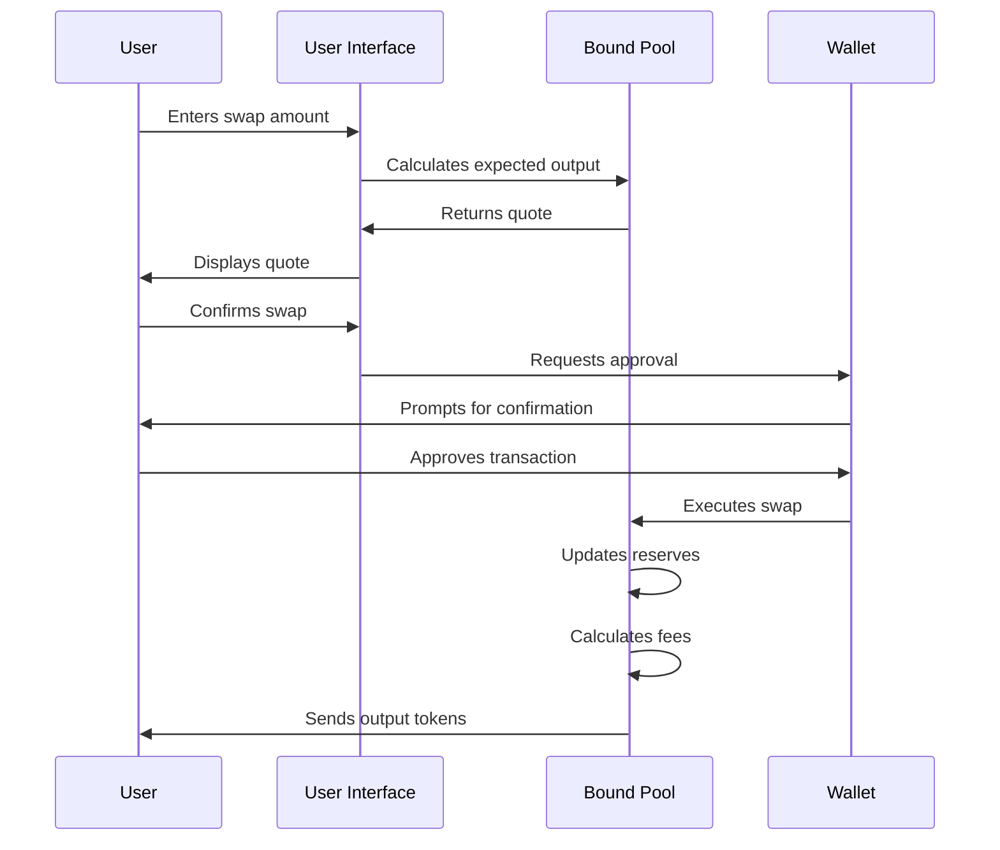
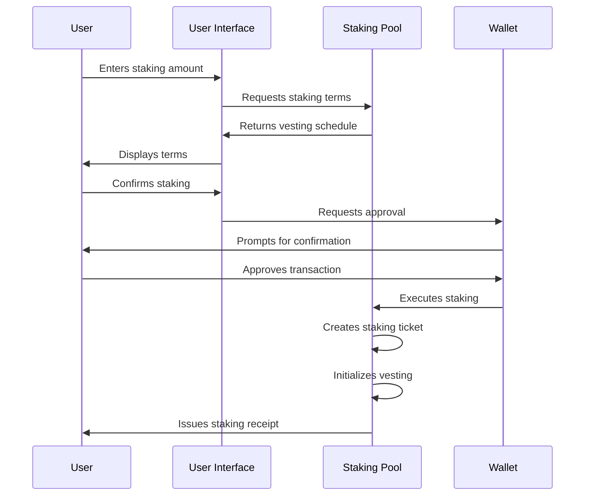
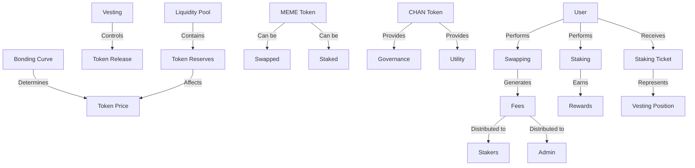
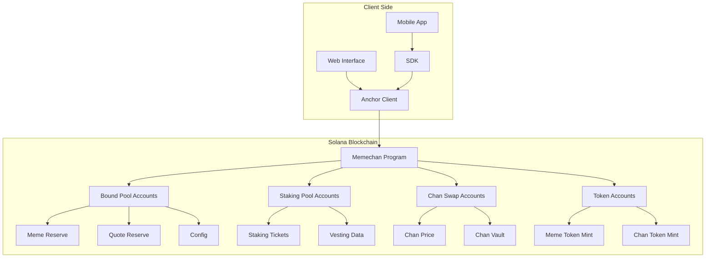
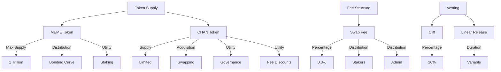
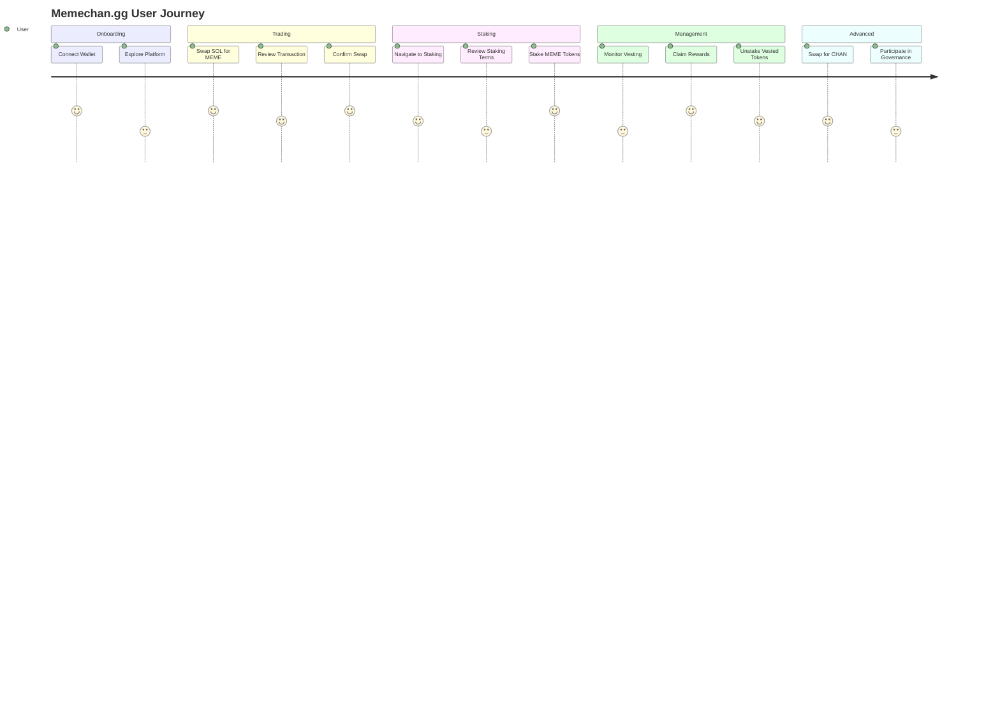
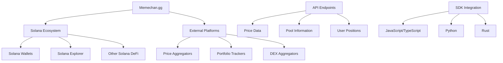
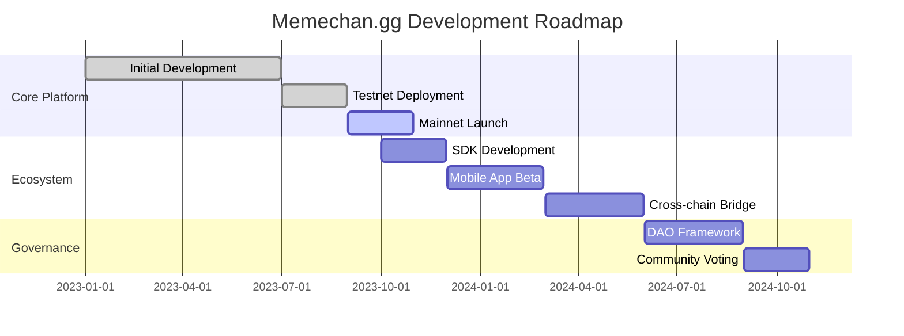

# Memechan.gg Knowledge Graph

This document provides a comprehensive knowledge graph of the Memechan.gg platform, visualizing the relationships between different components, concepts, and processes.

## Core Components Relationship



## Token Flow Diagram



## Process Flows

### Swap Process



### Staking Process



## Concept Map



## Technical Architecture



## Token Economics



## User Journey Map



## Integration Points



## Development Roadmap



## Glossary of Key Concepts

| Term | Definition |
|------|------------|
| **AMM** | Automated Market Maker - A type of decentralized exchange protocol that uses a mathematical formula to price assets |
| **Bonding Curve** | A mathematical curve that defines the price relationship between a token's supply and its price |
| **Vesting** | The process of gradually earning access to tokens over a predetermined period |
| **Cliff** | An initial period after which a portion of tokens becomes available |
| **Linear Vesting** | A vesting schedule where tokens are released at a constant rate over time |
| **Staking** | The process of locking up tokens to support network operations and earn rewards |
| **Liquidity Pool** | A collection of funds locked in a smart contract to facilitate trading |
| **Slippage** | The difference between expected price and execution price due to market movement |
| **PDA** | Program Derived Address - A deterministic address derived from a program ID and seeds |
| **CPI** | Cross-Program Invocation - When one Solana program calls another |
```