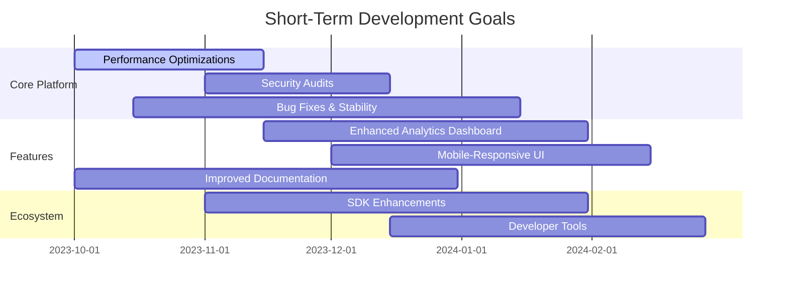
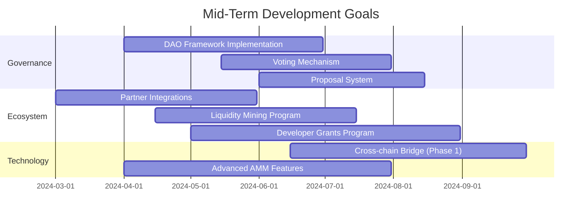
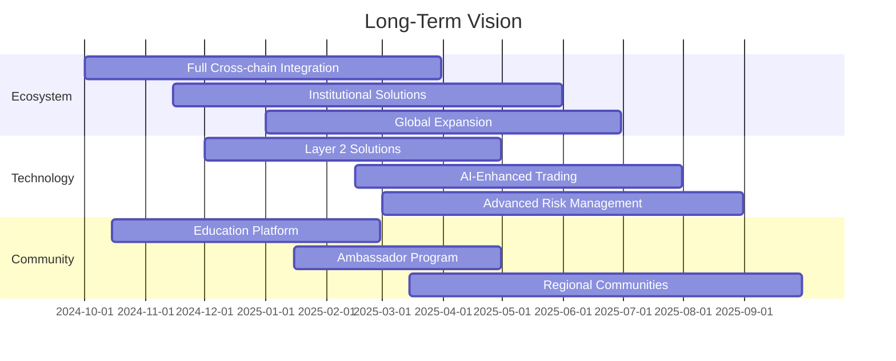

# Memechan.gg Development Roadmap

This document outlines the planned development roadmap for the Memechan.gg platform, including upcoming features, improvements, and long-term goals.

## Current Status

The Memechan.gg platform is currently in its initial release phase with the following core features implemented:

- Custom bonding curve AMM for MEME/SOL trading
- Staking mechanism with vesting schedules
- CHAN token swapping functionality
- Fee collection and distribution system
- Basic admin controls

## Short-Term Goals (Q4 2023 - Q1 2024)

### Platform Stability and Performance

1. **Performance Optimizations**
   - Optimize transaction processing for high-volume periods
   - Reduce computational complexity of key operations
   - Implement batched processing for certain operations

2. **Security Enhancements**
   - Complete comprehensive security audit
   - Implement additional security measures based on audit findings
   - Establish bug bounty program

3. **Reliability Improvements**
   - Enhance error handling and recovery mechanisms
   - Implement additional automated testing
   - Improve monitoring and alerting systems

### Feature Enhancements

1. **Analytics Dashboard**
   - Real-time trading volume metrics
   - Staking analytics and projections
   - Fee collection and distribution tracking
   - Historical performance data

2. **User Experience**
   - Mobile-responsive interface improvements
   - Simplified onboarding process
   - Enhanced transaction status feedback
   - Improved wallet integration

3. **Documentation and Support**
   - Comprehensive user guides
   - Developer documentation
   - API reference
   - Community support resources

## Mid-Term Goals (Q2 2024 - Q3 2024)

### Governance System

1. **DAO Implementation**
   - Decentralized governance framework
   - CHAN token-based voting rights
   - Treasury management system
   - Transparent governance processes

2. **Voting Mechanism**
   - On-chain voting for protocol changes
   - Delegation capabilities
   - Vote weighting based on staking duration
   - Quadratic voting exploration

3. **Proposal System**
   - Structured proposal framework
   - Discussion and amendment process
   - Execution of approved proposals
   - Emergency response mechanisms

### Ecosystem Expansion

1. **Partner Integrations**
   - Integration with major Solana DeFi protocols
   - Wallet partnerships
   - Data provider collaborations
   - Cross-promotion opportunities

2. **Liquidity Mining Program**
   - Incentivized liquidity provision
   - Strategic token distribution
   - Long-term sustainability focus
   - Community-driven parameter adjustments

3. **Developer Grants Program**
   - Funding for ecosystem development
   - Hackathons and challenges
   - Educational resources
   - Mentorship opportunities

### Technical Advancements

1. **Cross-chain Functionality (Phase 1)**
   - Initial bridge to Ethereum
   - Cross-chain asset transfers
   - Unified liquidity management
   - Security-focused implementation

2. **Advanced AMM Features**
   - Concentrated liquidity options
   - Multi-token pools
   - Dynamic fee adjustment
   - Improved price oracle functionality

## Long-Term Vision (Q4 2024 and Beyond)

### Ecosystem Maturity

1. **Comprehensive Cross-chain Strategy**
   - Support for multiple blockchain ecosystems
   - Unified liquidity across chains
   - Cross-chain governance participation
   - Seamless user experience across networks

2. **Institutional Adoption**
   - Compliance-focused features
   - Advanced security measures
   - High-volume trading capabilities
   - Institutional-grade analytics and reporting

3. **Global Market Expansion**
   - Localization for key markets
   - Regional community building
   - Regulatory compliance framework
   - Strategic regional partnerships

### Technological Innovation

1. **Layer 2 and Scaling Solutions**
   - Integration with Solana scaling solutions
   - Optimized transaction processing
   - Reduced fees for users
   - Improved throughput during high demand

2. **AI and Advanced Analytics**
   - Machine learning for trading optimization
   - Predictive analytics for market trends
   - Risk assessment tools
   - Personalized user insights

3. **Advanced Risk Management**
   - Sophisticated liquidation mechanisms
   - Insurance fund implementation
   - Circuit breakers and safety measures
   - Stress testing and scenario planning

### Community Development

1. **Education Platform**
   - Comprehensive learning resources
   - Interactive tutorials and courses
   - Certification programs
   - Community-led education initiatives

2. **Ambassador and Contributor Program**
   - Global ambassador network
   - Contributor recognition system
   - Community leadership development
   - Local meetups and events

3. **Decentralized Autonomous Organization (DAO) Evolution**
   - Fully decentralized governance
   - Community-driven development
   - Transparent treasury management
   - Sustainable incentive structures

## Success Metrics

The success of the Memechan.gg platform will be measured by the following key metrics:

1. **User Adoption**
   - Active user growth
   - Transaction volume
   - Retention rates
   - User satisfaction scores

2. **Ecosystem Health**
   - Total value locked (TVL)
   - Liquidity depth
   - Developer activity
   - Integration partnerships

3. **Technical Performance**
   - System uptime and reliability
   - Transaction processing speed
   - Fee efficiency
   - Security track record

4. **Community Engagement**
   - Governance participation
   - Community contributions
   - Social media engagement
   - Educational program participation

## Conclusion

The Memechan.gg roadmap represents our commitment to building a robust, user-friendly, and innovative DeFi platform on Solana. While we have outlined our planned development trajectory, we remain adaptable to market conditions, user feedback, and technological advancements.

We invite the community to participate in shaping the future of Memechan.gg through feedback, contributions, and governance participation as we work together to create a leading decentralized finance ecosystem.