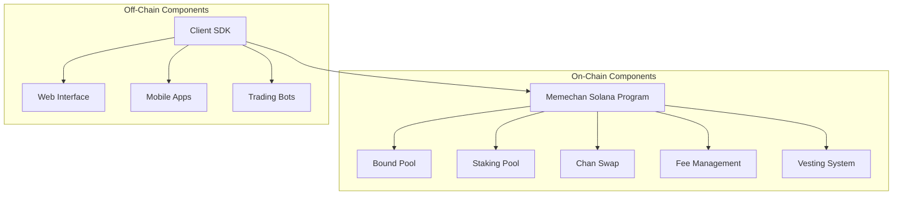

# Memechan.gg Technical Specification

This document provides detailed technical information about the Memechan.gg Solana implementation, including architecture, data structures, algorithms, and implementation details.

## Table of Contents

- [System Architecture](#system-architecture)
- [Smart Contract Structure](#smart-contract-structure)
- [Data Models](#data-models)
- [Key Algorithms](#key-algorithms)
- [Security Considerations](#security-considerations)
- [Integration Guide](#integration-guide)

## System Architecture

### High-Level Architecture

The Memechan.gg platform consists of several interconnected components that work together to provide a complete DeFi experience:



### Component Interactions

The system components interact through a series of transactions and account updates:

1. **Bound Pool Operations**:
   - Pool creation and initialization
   - Token swapping (SOL to MEME and vice versa)
   - Fee collection and distribution

2. **Staking Operations**:
   - Staking MEME tokens
   - Claiming rewards
   - Unstaking with vesting release

3. **Chan Swap Operations**:
   - Swapping MEME for CHAN tokens
   - Price adjustments by admin

## Smart Contract Structure

### Program Entry Points

The Memechan Solana program exposes the following main entry points:

| Function | Description |
|----------|-------------|
| `new_pool` | Creates a new Bound Pool with initial parameters |
| `create_metadata` | Creates metadata for the MEME token |
| `swap_x` | Swaps MEME tokens for SOL |
| `swap_y` | Swaps SOL for MEME tokens |
| `init_staking_pool` | Initializes a staking pool |
| `unstake` | Releases staked tokens according to vesting schedule |
| `new_chan_swap` | Creates a new CHAN swap pool |
| `change_chan_price` | Updates the CHAN token price |

### Directory Structure

```
memechan-sol/
├── programs/
│   └── memechan-sol/
│       ├── src/
│       │   ├── consts.rs         # Constants and configuration
│       │   ├── endpoints/        # Program instruction handlers
│       │   ├── err.rs            # Error definitions
│       │   ├── libraries/        # Utility libraries
│       │   ├── math/             # Mathematical implementations
│       │   ├── models/           # Data structures
│       │   └── vesting.rs        # Vesting implementation
│       └── Cargo.toml            # Rust dependencies
├── tests/                        # Integration tests
├── migrations/                   # Database migrations
└── Anchor.toml                   # Anchor configuration
```

## Data Models

### Core Data Structures

#### BoundPool

The BoundPool is the central data structure that manages the bonding curve between SOL and MEME tokens:

```rust
pub struct BoundPool {
    pub meme_reserve: Reserve,        // MEME token reserve
    pub quote_reserve: Reserve,       // SOL (quote) token reserve
    pub config: Config,               // Bonding curve configuration
    pub fees: Fees,                   // Fee structure
    pub locked: bool,                 // Pool lock status
    pub creator_addr: Pubkey,         // Pool creator address
    pub airdropped_tokens: u64,       // Tokens for airdrop
    pub vesting_period: i64,          // Vesting period duration
    pub admin_fees_meme: u64,         // Accumulated MEME fees
    pub admin_fees_quote: u64,        // Accumulated SOL fees
    pub fee_vault_quote: Pubkey,      // Fee vault address
}
```

#### StakingPool

The StakingPool manages staking operations and rewards:

```rust
pub struct StakingPool {
    pub pool: Pubkey,                 // Associated bound pool
    pub meme_vault: Pubkey,           // MEME token vault
    pub meme_mint: Pubkey,            // MEME token mint
    pub quote_vault: Pubkey,          // SOL token vault
    pub quote_mint: Pubkey,           // SOL token mint
    pub chan_vault: Pubkey,           // CHAN token vault
    pub quote_amm_pool: Pubkey,       // Quote AMM pool
    pub chan_amm_pool: Pubkey,        // CHAN AMM pool
    pub vesting_config: VestingConfig, // Vesting configuration
    pub stakes_total: u64,            // Total staked tokens
    pub fees_x_total: u64,            // Total X fees
    pub fees_y_total: u64,            // Total Y fees
    pub fees_z_total: u64,            // Total Z fees
    pub to_airdrop: u64,              // Tokens for airdrop
    pub is_active: bool,              // Pool active status
}
```

#### MemeTicket

MemeTicket represents a user's staked tokens with vesting information:

```rust
pub struct MemeTicket {
    pub pool: Pubkey,                 // Associated pool
    pub owner: Pubkey,                // Ticket owner
    pub amount: u64,                  // Token amount
    pub vesting: VestingData,         // Vesting data
    pub lock_end: i64,                // Lock end timestamp
}
```

#### VestingConfig and VestingData

These structures manage the token vesting process:

```rust
pub struct VestingConfig {
    pub start_ts: i64,                // Start timestamp
    pub cliff_ts: i64,                // Cliff timestamp
    pub end_ts: i64,                  // End timestamp
}

pub struct VestingData {
    pub released: u64,                // Released tokens
    pub notional: u64,                // Total tokens
}
```

## Key Algorithms

### Bonding Curve Implementation

The bonding curve uses a mathematical formula to determine token prices based on supply:

```
price = alpha_abs * (current_supply / max_supply)^beta
```

Where:
- `alpha_abs` is a scaling factor
- `beta` controls the curve steepness
- `current_supply` is the current token supply
- `max_supply` is the maximum token supply

### Vesting Calculation

The vesting system calculates releasable tokens using:

```rust
pub fn total_vested(&self, config: &VestingConfig, current_ts: i64) -> u64 {
    let cliff_amount = self
        .notional
        .mul_div_floor(INSTANT_TOKEN_PERCENTAGE_NUM, INSTANT_TOKEN_PERCENTAGE_DENOM)
        .unwrap();
    if current_ts <= config.cliff_ts {
        return cliff_amount;
    }

    if current_ts >= config.end_ts {
        return self.notional;
    }

    let passed = (current_ts as u64)
        .checked_sub(config.cliff_ts as u64)
        .unwrap();
    let total = config.duration() as u64;
    let tokens_after_cliff = self.notional - cliff_amount;

    cliff_amount + tokens_after_cliff.mul_div_floor(passed, total).unwrap()
}
```

### Swap Amount Calculation

Token swap amounts are calculated based on the bonding curve and current reserves:

```rust
pub fn compute_swap_quote(
    &self,
    coin_in_amount: u64,
    is_quote_in: bool,
) -> Result<SwapAmount> {
    // Complex calculation based on bonding curve parameters
    // ...
}
```

## Security Considerations

### Access Control

The program implements several security measures:

1. **Admin-only functions**: Functions like `change_target_config` and `withdraw_admin_fees` are restricted to admin accounts.

2. **PDA-based authentication**: Program-derived addresses (PDAs) are used to authenticate operations on token accounts.

3. **Constraint checks**: Each instruction includes constraint checks to validate account relationships and permissions.

### Numerical Stability

The program uses several techniques to ensure numerical stability:

1. **Fixed-point arithmetic**: Custom implementations for precise calculations.

2. **Overflow protection**: Checked arithmetic operations to prevent overflows.

3. **Minimum/maximum bounds**: Parameters are constrained within safe ranges.

## Integration Guide

### Client SDK Usage

To integrate with the Memechan.gg platform:

1. **Initialize the client**:

```typescript
import { Connection, PublicKey } from '@solana/web3.js';
import { Program, Provider } from '@coral-xyz/anchor';
import { BoundPoolWrapper } from './bound_pool';

// Initialize connection and provider
const connection = new Connection('https://api.mainnet-beta.solana.com');
const provider = new Provider(connection, wallet, {});

// Initialize the bound pool wrapper
const poolAddress = new PublicKey('pool_address_here');
const boundPool = new BoundPoolWrapper(provider, poolAddress);
```

2. **Perform swaps**:

```typescript
// Swap SOL for MEME
const ticketId = await boundPool.swap_y({
  memeTokensOut: new BN(desiredMemeAmount),
  quoteTokensIn: new BN(solAmount * 1e9),
});

// Swap MEME for SOL
await boundPool.swap_x({
  memeTokensIn: new BN(memeAmount),
  quoteTokensOut: new BN(minimumSolExpected * 1e9),
});
```

3. **Stake tokens**:

```typescript
// Initialize staking pool
const stakingPool = await StakingPoolWrapper.new(boundPool);

// Stake tokens
await stakingPool.stake(amountToStake);

// Unstake tokens
await stakingPool.unstake(amountToUnstake);
```

### Transaction Signing

All transactions require proper signing:

```typescript
// Create a transaction
const transaction = new Transaction();
transaction.add(
  // Instruction here
);

// Sign and send the transaction
const signature = await provider.sendAndConfirm(transaction);
console.log('Transaction signature:', signature);
```

### Error Handling

Handle program errors appropriately:

```typescript
try {
  // Perform operation
} catch (error) {
  if (error.code) {
    // Handle specific error codes
    switch (error.code) {
      case 6000:
        console.error('Invalid parameters');
        break;
      // Other error codes
      default:
        console.error('Unknown error:', error);
    }
  } else {
    console.error('Transaction error:', error);
  }
}
```

## Appendix

### Glossary

- **AMM**: Automated Market Maker
- **Bonding Curve**: Mathematical formula determining token price based on supply
- **PDA**: Program Derived Address
- **Vesting**: Gradual release of tokens over time
- **Cliff**: Initial period before linear vesting begins

### References

- [Solana Documentation](https://docs.solana.com/)
- [Anchor Framework](https://www.anchor-lang.com/)
- [SPL Token Standard](https://spl.solana.com/token)